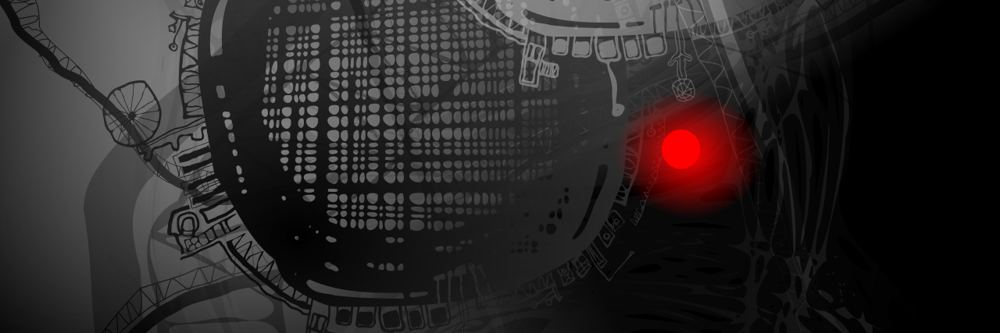

# nOn-antropomorphic
### by Igor Yaroshenko 
[author verification](https://line2.biz/about_me.json)

---

**Focus:** Post-Anthropocentric Vision
A departure from the human-centric worldview. How do other species—ants, whales, crows—perceive our world? This project explores their "vision" of our insane industrial structures and urban landscapes, echoing the themes of Stanislaw Lem’s *Solaris*. It is an attempt to visualize the incomprehensible.

* **Lab:** [grph](https://github.com/yarosh9/grph),  [grph_00](https://github.com/yarosh9/grph_00)
* **Web Interface:** [grph](https://yarosh9.github.io/grph/)
* **Provenance Layer** [non-anthropomorphic](https://line2.biz/non-anthropomorphic)

---

Моя творчість — це спроба вийти за межі антропоморфного сприйняття. Я досліджую, якою була б логіка та краса мистецтва, якби його створили не люди, а кити, мурахи або інша форма свідомості. Це пошук точки, де наше людське бачення може співпасти з нелюдським, і де феромонна мова мурах та пісня кита стануть зрозумілими. Через векторну графіку я створюю не просто зображення, а інтуїтивні коди. Це мистецтво існує на перетині технології та інтуїції. Моя мета — знайти ту логічну гармонію та емоційну ейфорію від созерцання, що стануть основою для справжнього, емпатійного діалогу. У цьому злитті логіки та естетики і починається справжнє спілкування.

My creative work is an attempt to transcend anthropomorphic perception. I explore what the logic and beauty of art would be if crafted by non-human intelligences—be it whales, ants, or another form of consciousness. This is a quest for a point where our human vision can converge with the non-human, where the pheromone language of ants and the songs of whales become comprehensible. Through vector graphics, I craft not just images, but intuitive codes. This art exists at the intersection of technology and intuition. My goal is to find the logical harmony and emotional euphoria of contemplation that can become the basis for true, empathetic dialogue. In this seamless fusion of logic and aesthetics, genuine communication begins.

## Content

* [files](./svg)

## Inspiration  

Digital **alchemy**, techno-utopian visions, and the organic flow of code.

## How to Use  

- Download the SVG files.
- Request size adjustments before printing.
- Do not modify colors or shapes.
- Do not combine them to create unique effects.

## Thanks

Great appreciation to **Wassily Kandinsky**, whose works and philosophy have inspired and continue to inspire!

This project (NEANTHROPOMORPHICS) is licensed under the Creative Commons Attribution-NoDerivatives 4.0 International (CC BY-ND 4.0).
The full text of the license is available in the LICENSE file.

* [Wassily Kandinsky on WikiArt](https://www.wikiart.org/en/wassily-kandinsky)

---

## 📡 Architecture
The ecosystem is integrated via a unified **Metadata Standard**. Every repository is guided by a `project_map.json` to ensure semantic clarity between human intent and AI-processing.

Identity verified by RS_973 Protocol: [Provenance Layer](https://line2.biz/rs_973.json)

---
© 2026 Igor Yaroshenko. All rights reserved.
#### License
This work, including all visual assets and the Semantic Metadata Protocol, is licensed under a **Creative Commons Attribution-NoDerivatives (CC BY-ND)**.  
